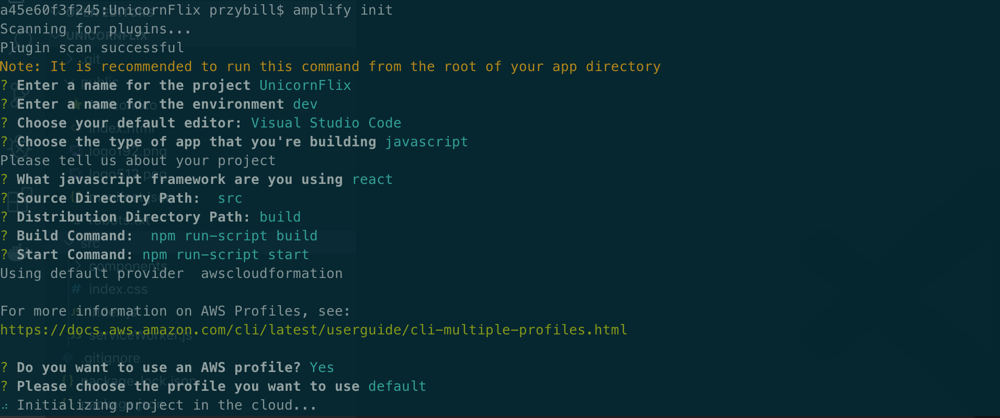
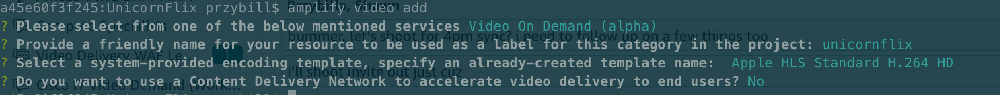
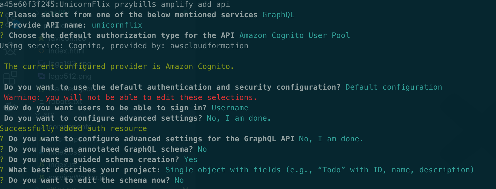
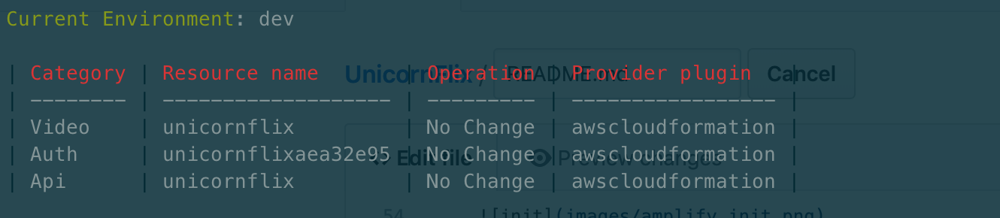
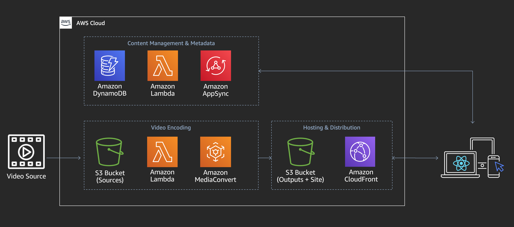

# UnicornFlix

Welcome to UnicornFlix. As the first developer here at UnicornFlix it's your mission to bring humanity closer to the Unicorn kingdom by serving up premium Unicorn videos to subscribers. You've been asked by the founders to develop a minimum-lovable-product to begin serving videos to users as soon as possible. They've also asked you to keep operational overhead at a minimum and to keep the API design flexible as the business model could pivot at any moment.

In this workshop we will build the video on demand streaming platform that allows you to upload, process, and serve videos to authenticated users.

The workshop is split into three primary sections with a collection of optional extensions:

**Backend Deployment with Amplify CLI** - Use the Amplify CLI to deploy the API, Authentication, and Video Streaming infrastructure.

**Web Client Admin View** - Build a web application to add videos and associate basic metadata.

**Web Client User View** - Stream videos to users who have signed into the service.

**Optional Extensions** - An optional section containing a collection of tutorials to extend the application functionality.

## Setting up Development Environment

You just started at UnicornFlix and they hooked you up with a brand new laptop - _sweeeet!_ Now let's configure your development environment. 

1. Clone the UnicornFlix workshop by running `git clone https://github.com/wizage/UnicornFlix.git` or by downloading the zip [here](https://github.com/awslabs/unicornflix/archive/master.zip)
1. Download and install Node and Node Package Manager (NPM) if you don't already have it from [nodejs.org](https://nodejs.org/en/download/). Select **LTS** for the node version.
1. Install AWS Amplify CLI using this command `npm install -g @aws-amplify/cli`
1. Install Amplify Video, a custom AWS Amplify CLI plugin for creating our video resource, by running `npm install -g amplify-category-video`

## Backend Deployment with Amplify CLI

1. First, open a terminal and navigate to the UnicornFlix directory that was created when you cloned the repository or unzipped it.
**Please make sure the left hand side says UnicornFlix.** If it does not please use `cd UnicornFlix`
1. If you are running this event at AWS with Event Engine please click to expand for additional environment configuration steps:
    <details>
        <summary>Click here to expand</summary>

    1. Obtain your hash from the event lead and visit https://dashboard.eventengine.run/login
    1. Login in using your hash and click on the use console button
    1. A popover will appear with your AWS console access fedaration link and AWS CLI profile links
    1. Open up your AWS profile folder on your computer ( `~/.aws/` for Mac and Linux and `C:\Users\USERNAME \.aws\` for windows)
    1. If you don't have a AWS profile folder you need to create it and add in two files. One file called `credentials` and `config`.
    1. Edit your `credentials` file by adding in a new profile like so (copying the values from the popover in event engine). Please note that the creditials file is all lowercase (in Event Engine it is uppercase).
        ```
        [ee]
        aws_access_key_id = XXXXXXXXXXXXXXXX
        aws_secret_access_key = XXXXXXXXXXXXXXXXXXXXXXXXX
        aws_session_token = XXXXXXXXXXXXXXXXXXXXXXXXXXXXXXXXXXXXXXXXXXXXXXXXXX
        ```
    1. Edit your `config` file by adding default values (changing your region to the assigned region of your event)
        ```
        [ee]
        region = us-west-2
        output = json
        ```
    1. When running `amplify init` choose the newly created profile called `ee` (**Note:** please don't select default)
    </details>
1. Run `amplify init`. This command creates new AWS backend resources (in this case a single S3 bucket to host your cloudformation templates) and pull the AWS service configurations into the app!
1. Follow the prompts as shown in the below Image.
    1. **PLEASE DOUBLE CHECK THE PROFILE YOU ARE USING. ONCE YOU CHOOSE ONE YOU CAN'T GO BACK UNLESS YOU DELETE EVERYTHING IN THE CLOUD**
    1. Note that because of the services leveraged, your AWS profile **MUST USE** us-west-2, us-east-1, eu-west-1, eu-central-1, ap-northeast-1, or ap-southeast-2.
    
1. Now, add the amplify video module to the project using `amplify video add`
1. Follow the prompts as shown in the image below. We'll be building in a basic content management system (CMS) as part of our VOD platform.
     
      
1. Once the prompts complete, make sure the module was added by checking `amplify status`
        
1. Now it is time to actually create the resources by pushing the configuration to the cloud. Run `amplify push` to create the backend video resource which is comprised of the services necessary to manage, process, and serve our videos. It will take a few minutes to stage and create the resources in your AWS environment. While that runs, let's take a brief look at what was just created:

    

In addition to these services, Amplify Video also manages a Amazon Cognito user pool to handle authentication. We'll use this later to handle log-in and grant administration privileges for specific users.

TODO - Explain the resources created by amplify video (specifically what each resource is doing)

With the infrastructure deployed, let's test processing and streaming a video asset. 

1. Open the S3 console and upload a small video file to the 'Input Storage Bucket' which was returned when you ran amplify push. You can download and upload [this sample clip](images/sample.mp4) if you don't have your own video handy.
1. Check the MediaConvert console, you should see an asset in 'progressing' shortly after the upload to S3 completes. Once the MediaConvert job is finished, continue on to the next step.
1. In the 'Output Storage Bucket' you should see a .m3u8 manifest object. Select all objects and select 'make public.' DO NOT do this with a bucket or content that is private this is only for workshop demonstration and testing purposes.
1. Finally, access the .m3u8 object url from the properties page of S3 and open it in safari, iOS, or by using a test player like the [JW Player Stream Tester](https://developer.jwplayer.com/tools/stream-tester/)

Congratulations! You are hosting a Video-on-Demand platform on AWS! Now let's setup a website that we will use to upload more content and deliver it to viewers.

## Web Client Admin View  

We've pre-created a web application that will serve as the basis for your development. The application is split into two views. The Admin view allows UnicornFlix employees video management capabilities and the User view is where subscribers access content after they've logged into the site.

1. To install the dependencies necessary to run the website locally run `npm install` from the UnicornFlix directory
1. Next, to run the website with a local development environment run `npm start` and navigate to the page running on localhost.

 TODO - Update with screenshot of empty site

1. We will need to add two more npm packages to the client that are part of the Amplify ecosystem. aws-amplify is a javascript library that provides a declarative interface across amplify catagories, like auth, in order to make them easier to add them into your application. aws-amplify-react applies similar interfaces for the React framework.

```
npm i aws-amplify
npm i aws-amplify-react
```
Drop in the authenticator component and configure it to wrap the Admin react component that renders the Admin page.

1. Navigate to unicornflix/src/components/Admin/index.js
    1. At the bottom of the import block, add:

    ```import { withAuthenticator } from 'aws-amplify-react'; ```
    1. Change line 64 ```export default Admin;``` to:

    ```export default withAuthenticator(Admin, true);```

Create an admin user through the Cognito console. 

  1. Open the AWS Management Console and Search for Cognito.
  1. Select the blue "Manage User Pools" button
  1. Select the userpool labeled "Unicornflix"
  1. Under General Settings, choose "Users and Groups".
  1. Select the blue "create user" button and enter the user creation form.
  1. Fill out the form to create a user. Now we will have to add admin privilages in order to enable this user to publish videos through the app.
  1. Select the user you just created
  1. Select the blue "Add to Group" button, and select the admin group.

Now that we have an admin user, let's implement the asset upload logic that enables them to create new assets on the platform.

  1. Navigate to unicornflix/src/Components/Admin/index.js
  1. In the componentDidMount function paste the following code into the function body. Note: you will have to input the name of your unicornflix s3 bucket and region into the object below)
  ```
  Storage.configure({
      AWSS3: {
          bucket: '<BUCKET-NAME>',
          region: '<REGION>'
      }
    })
    .then (result => console.log(result))
    .catch(err => console.log(err));
  ```
  1. Find the submitFormHandler(event) function and add the following code to the function body. This is the form that contains basic metadata to be submitted alongside the asset upload.
  ```
  const object = {
        input: {

            title: this.state.titleVal,
            description:this.state.descVal
        }
    }
    
    API.graphql(graphqlOperation(createVodAsset, object)).then((response,error) => {
          console.log(response.data.createVodAsset);
    });
  ```
  1. Next, staying in the submitFormHandler(event) function, add the following code underneath the API.graphql call. This code will use the storage API to upload the video content to S3 using multipart upload if necessary.
  ```
      Storage.put(this.state.fileName, this.state.file, {
      contentType: 'video/*'
    })
    .then (result => console.log(result))
    .catch(err => console.log(err));
      event.preventDefault();
  ```

Let's put our implementation of the admin page to the test by uploading an asset.

  1. Navigate back to the application running on your Localhost.
  1. Log in to the admin user you created. Note: if you were previously logged in before creating your admin user, log out and log back in to refresh your tokens giving you access to post content.
  1. Navigate to the Admin Panel.
  1. Fill out the form and select a video with the file picker. 
  1. Once all the fields have been selected, choose the "submit" button to begin the upload process.

Since we haven't implemented the user view yet, let's use the AWS console to explore what happened when we created the asset.

  1. Open the aws management console and navigate to the dynamodb service using the search bar.
  1. In the left hand side bar, choose "Tables"
  1. You should see 2 Dynamo Tables that were deployed on your behalf: Vodasset- and VideoObject-.
  1. Select the VodAsset- table and choose "Items" to view the asset you just pushed to the cloud using the Application. Here you can see that the API gave each asset a GUID as well as createdAt/updatedAt feilds.
  1. In the management console, select the services drop down from the top left corner of the browser screen.
  1. In the search bar type MediaConvert and navigate to the Elemental MediaConvert service page.
  1. Expand the left hand side menu and choose "Jobs"
  1. You should see a transcode job that was kicked off when you uploaded an asset through the console. You can view the input file name to be sure that the upload from the application was successful.
  1. (Optional) Select the job and select the "View JSON" button in the top right of the screen. Here you can view the job file which was submitted to the Elemental MediaConvert Service. Here, you can view the input and output locations as well as presets used during the transcode process.

Now that we have a functioning backend with an admin portal, let's setup the end-user view.

## Web Client User View

 Add the authenticator component to ensure only signed-in users can access videos on UnicornFlix

  1. Navigate to unicornflix/src/components/App/index.js
  1. At the bottom of the import block, add:

  ```import { withAuthenticator } from 'aws-amplify-react'; ```
  1. Change line 23 ```export default App;``` to:

  ```export default withAuthenticator(App, true);```

Create an actual user account using the app sign-up page instead of the Cognito console.

  1. Refresh the tab that the application is running in to see the login page. (react's local dev server may do this for you)
  1. Create a new user. This user will not be an admin and thus won't have rights to publish content to UnicornFlix.

  
1. TODO - implement Pagination using graphql queries
    1. Navigate to unicornflix/src/Components/GridView/index.js
    1. Find Location 1: inside of the componentDidMount function and paste the following code:
    ```
    const allTodos = await API.graphql(graphqlOperation(queries.listVodAssets));
    var nextToken = allTodos.data.listVodAssets.nextToken;
    if(nextToken == undefined){
      nextToken = "";
    }
    this.setState({items: allTodos.data.listVodAssets.items, nextToken: nextToken})
    this.listenForNewAssets();
    ```
    1. Find Location 2: inside of the listenForNewAssets function and paste the following code:
    ```
      const allTodos = await API.graphql(graphqlOperation(queries.listVodAssets,{nextToken:this.state.nextToken}));
      var items = this.state.items.concat(allTodos.data.listVodAssets.items);
      console.log(this.state.token);
      var nextToken = allTodos.data.listVodAssets.nextToken;
      if(nextToken == undefined){
        nextToken = "";
      }
      this.setState({items: items, nextToken: nextToken});
    ```
1. TODO - implement GraphQL subscription
    1. Navigate back to unicornflix/src/Components/GridView/index.js
    1. Add the following line of code to the bottom of the import block: ```import { onCreateVodAsset } from '../../graphql/subscriptions';```
    1. Search for the listenForNewAssets function and paste the following code into the function body.

    ```
    API.graphql(
      graphqlOperation(onCreateVodAsset)
    ).subscribe({
      next: (((data) => {
        console.log(data.value.data.onCreateVodAsset);
        console.log("RIP");
        var newItemList = this.state.items.push(data.value.data.onCreateVodAsset);
        console.log(newItemList);
        this.setState({
            //items:newItemList
        });
      }).bind(this))
    })
```

1. TODO - playback video
1. TODO - upload another asset to see the entire workflow function from end-to-end


## Extend the Application

1. TODO - Custom Metadata field (keywords, cast, etc)
1. TODO - Host your app with amplify console


