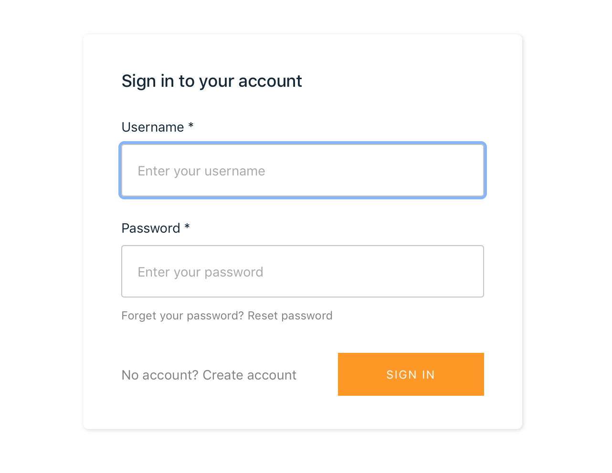

# UnicornFlix

Welcome to UnicornFlix. As the first developer here at UnicornFlix it's your mission to bring humanity closer to the Unicorn kingdom by serving up premium Unicorn videos to subscribers. You've been asked by the founders to develop a minimum-viable-product to begin serving videos to users as soon as possible. They've also asked you to keep operational overhead at a minimum and to keep the API design flexible as the business model could pivot at any moment.

In this workshop we will build the video on demand streaming platform that allows you to upload, process, and serve videos to authenticated users.

The workshop is split into three primary sections with a collection of optional extensions:

**Backend Deployment with Amplify CLI** - Use the Amplify CLI to stand up the backend infrastructure combining the API, Auth and Video.

**Web Client Admin View** - Build a web application to add videos and associate basic metadata.

**Web Client User View** - Expose the videos to users who have signed up for the service.

**Optional Extensions** - An optional section with a collection of tutorials that extend the application functionality.

## Setting up Development Environment

You just started at UnicornFlix and they hooked you up with a brand new laptop - _sweeeet!_ Now let's configure your development environment. 

1. Clone the UnicornFlix workshop by running `git clone https://github.com/wizage/UnicornFlix.git` or by downloading the zip [here](https://github.com/wizage/UnicornFlix/archive/master.zip)
1. Download and install Node and Node Package Manager (NPM) if you don't already have it from [nodejs.org](https://nodejs.org/en/download/). Select **LTS** for the node version.
1. Install AWS Amplify CLI using this command `npm install -g @aws-amplify/cli`
1. Install Amplify Video, a custom AWS Amplify CLI plugin, by running `npm install -g amplify-category-video`

## Backend Deployment with Amplify CLI

1. First, open a terminal and navigate to the UnicornFlix directory that was created when you cloned the repository or unzipped it.
**Please make sure the left hand side says UnicornFlix. If it does not please use `cd UnicornFlix`. If it doesn't say UnicornFlix please raise your hand!**
1. If you are running this event at AWS with Event Engine please follow these additional steps:
    <details>
        <summary>Click here to expand</summary>

    1. Obtain your hash from the event lead and visit https://dashboard.eventengine.run/login
    1. Login in using your hash and click on the use console button
    1. A popover will appear with your AWS console access fedaration link and AWS CLI profile links
    1. Open up your AWS profile folder on your computer ( `~/.aws/` for Mac and Linux and `C:\Users\USERNAME \.aws\` for windows)
    1. If you don't have a AWS profile folder you need to create it and add in two files. One file called `credentials` and `config`.
    1. Edit your `credentials` file by adding in a new profile like so (copying the values from the popover in event engine). Please note that the creditials file is all lowercase (in Event Engine it is uppercase).
        ```
        [ee]
        aws_access_key_id = XXXXXXXXXXXXXXXX
        aws_secret_access_key = XXXXXXXXXXXXXXXXXXXXXXXXX
        aws_session_token = XXXXXXXXXXXXXXXXXXXXXXXXXXXXXXXXXXXXXXXXXXXXXXXXXX
        ```
    1. Edit your `config` file by adding default values (changing your region to the assigned region of your event)
        ```
        [ee]
        region = us-west-2
        output = json
        ```
    1. When running `amplify init` choose the newly created profile called `ee` (**Note:** please don't select default)
    </details>
1. Run `amplify init`. This command creates new AWS backend resources (in this case a single S3 bucket to host your cloudformation templates) and pull the AWS service configurations into the app!
1. Follow the prompts as shown in the below Image.
    1. **PLEASE NOTE: PLEASE DOUBLE CHECK THE PROFILE YOU ARE USING. ONCE YOU CHOOSE ONE YOU CAN'T GO BACK UNLESS YOU DELETE EVERYTHING IN THE CLOUD**
    1. Note that because of the services leveraged, your AWS profile **MUST USE** us-west-2, us-east-1, eu-west-1, eu-central-1, ap-northeast-1, or ap-southeast-2.
    
1. Now, add the amplify video module to the project using `amplify video add`
1. Again, follow the prompts as shown in the image below. We'll be building in a basic content management system (CMS) as part of our VOD platform. (this will show as a single prompt flow during workshop)
     
      
1. Once the prompts complete, make sure the module was added by checking `amplify status`
        
1. Now it is time to create our resources. Run `amplify push` to create the backend video resource which is comprised of the services necessary to manage, process, and serve our videos. It will take a few minutes to stage and create the resources in your AWS environment. While that runs, let's take a brief look at what was just created:

    

1. With the infrastructure deployed, let's test processing and hosting an asset. Open the S3 console and upload a small video file to the oS3InputBucket output from the cloudformation template.
1. Check the mediaconvert console, you should see an asset in 'progressing' shortly after the upload completes. Once this successfully completes, move on to the next step.
1. In the oS3OutputBucket, you should seee a .m3u8 manifest object. Select all objects and select 'make public' (do not do this with a bucket or content that is private. this is only for our alpha lab)
1. Finally, access the .m3u8 object url from the properties page of S3 and open it in safari, iOS, or by using a test player like the [JW Player Stream Tester](https://developer.jwplayer.com/tools/stream-tester/)

Congratulations! You have now hosting a Video-on-Demand platform on AWS! Now let's setup a website that we will use to serve the content to authenticated users.

## Web Client Admin View

We've pre-created a simple javascript/react web application that will serve as the basis for our workshop.

1. To install the dependencies necessary to run the website locally run `npm install` from the UnicornFlix directory
1. Next, to run the website with a local development environment run `npm start`

(image of website)

1. THIS IS WHERE INFO ON SUBSCRIBING TO CMS WILL GO

## Web Client User View
When you are done checking out the application lets first add some auth to our application.

1. We will need to add two more npm packages to the client that are part of the amplify ecosystem:

```
npm i aws-amplify
npm i aws-amplify-react
```

2. Navigate to `./src/components/App/index.js` and add this statement to the top of the file to include them in the web application. These are the client-side amplify react modules necessary to plug our application in with the back-end infrastructure we created in the first section.

```
import Amplify from 'aws-amplify';
import awsconfig from ‘./../../aws-exports';
import { withAuthenticator } from 'aws-amplify-react'; // or 'aws-amplify-react-native';

Amplify.configure(awsconfig);
```

3. Then navigate to the bottom of the file and wrap the default App component with our auth to looks something like this:
```
export default withAuthenticator(App, true);
```

4. Restart your local webserver with `npm start` if it's not already running, then navigate to the localhost address of your website. You should now see a login page.



5. Signup for a new user account using any information you'd like, but note that a valid email is required to send an authentication code for sign-in.

6. THIS IS WHERE WE'LL SHOW THEM HOW TO GRANT/REVOKE ACCESS TO CONTENT 

